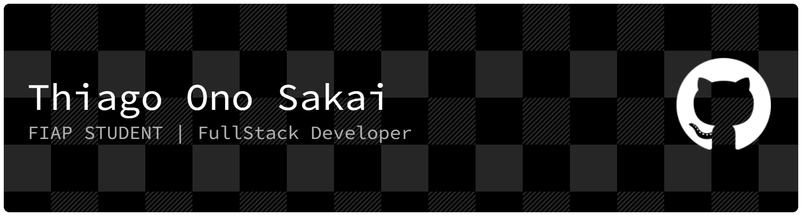

<!-- Banner animado e visual (substitua a URL por uma do LottieFiles, Canva ou Tenor, conforme sua preferência) -->

  

<!-- Se preferir GIF animado, use -->
<!--

  

-->

<!-- Badges sociais estilizados e ícones extras -->

  
  
  
  
  

---

## 🇧🇷 Português

### 👋 Olá, eu sou Thiago!

- 🧑‍💻 Desenvolvedor Full-Stack, Estudante da FIAP e entusiasta de IA.
- 🎯 Foco em Machine Learning, automação e gestão de projetos inovadores.
- 🚀 Apaixonado por inovação, jogos indie/RPG/FPS, tecnologia criativa e IA.
- 💡 Sempre aprendendo e compartilhando conhecimento.

#### 🛠️ **Tecnologias & Ferramentas**
- **Back-end:** Python, Node.js, JAVA, C#
- **Front-end:** React, HTML/CSS, Next.js
- **Banco de Dados:** MongoDB, SQL, PostgreSQL
- **Ciência de Dados:** Pandas, NumPy, Scikit-learn, Keras
- **DevOps:** Docker, Render
- **Extras:** Arduino, APIs públicas, N8N

#### 📊 **GitHub Stats**

  
  

#### 📂 **Projetos em Destaque**
- [Projeto Gamificado de Educação Financeira](URL)
- [Chat em tempo real](URL)
- [GPS_de_carreira](URL)

---

## 🇬🇧 English

### 👋 Hi, I'm Thiago Ono Sakai!

- 🧑‍💻 Full-Stack Developer, FIAP Student, and AI enthusiast.
- 🎯 Focused on Machine Learning, automation, and innovative project management.
- 🚀 Passionate about innovation, indie/RPG/FPS games, creative tech, and AI.
- 💡 Lifelong learner and knowledge-sharer.

#### 🛠️ **Technologies & Tools**
- **Back-end:** Python, Node.js, JAVA, C#
- **Front-end:** React, HTML/CSS, Next.js
- **Database:** MongoDB, SQL, PostgreSQL
- **Data Science:** Pandas, NumPy, Scikit-learn, Keras
- **DevOps:** Docker, Render
- **Others:** Arduino, Public APIs, N8N

#### 📂 **Featured Projects**
- [Gamified Financial Education Platform](URL)
- [Real life time chat](URL)
- [Career GPS](URL)

---

<!-- Animação opcional do grid contributions -->

  

